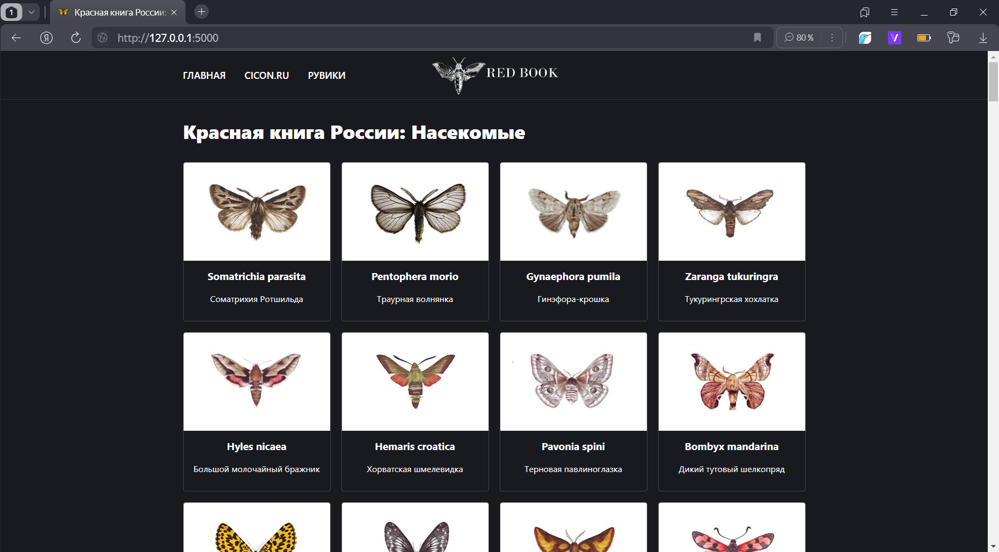
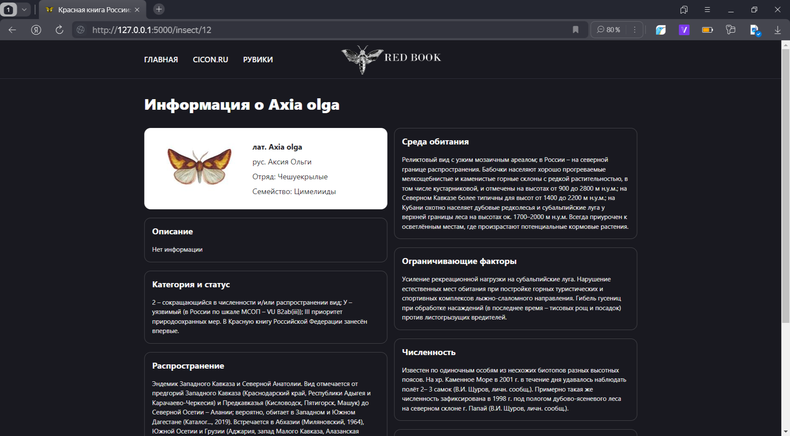

# FUFU 2024. Read Book Project

## Технологии
- Python
- Flack
- Docker
- Postgres
- liquibase
- HTML + CSS

## База данных
В проекте используется бд **postgres** и **liquibase** для управления миграция.
 Для запуска postgres и liquibase используется **Docker**.
- [liquibase миграция](./migrations)
- [docker-compose.yml](./docker-compose.yml)

## Модуль парсинга
Этот [модуль](./ParserProject) наполняет бд информацией о краснокнижных насекомых.

## Модуль парсинга
Этот [модуль](./SiteProject) отвечает за отображение информации из бд на сайте.

## Превью проекта
### Главная страница

### Cтраница с насекомым

